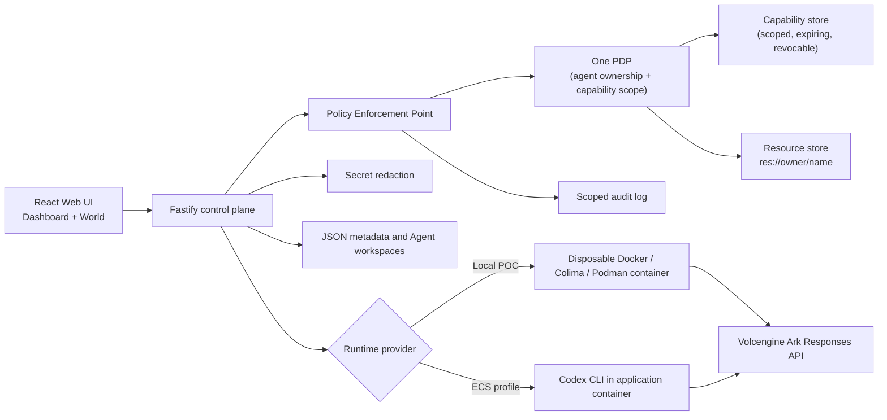

# Volc Agent Launchpad — Agent Pixel World

A middleware-free Agent platform starter kit, extended with a live
authorization-visualization layer: a top-down pixel-art office where every
door, keycard, and access request is a real allow/deny decision from the
backend's policy engine — not a scripted animation.

Run it locally with Docker, Colima, or rootless Podman, or deploy it to
Volcengine ECS.

> [!WARNING]
> This is a hackathon proof of concept. Capabilities are in-memory (lost on
> restart), there are two hard-coded demo users, and secrets are redacted but
> not otherwise hardened. Do not use production data or credentials. See
> [SECURITY.md](SECURITY.md) and §8 of
> [docs/PERSON3_CONTRACT.md](docs/PERSON3_CONTRACT.md).

## What this platform is

Underneath, it's still the original Agent CRUD control plane: create Codex
CLI agents, chat with them, watch their runs, persist their workspaces. On
top of that, `apps/web/src/world/` adds a second view — the **World** — that
renders those same agents as characters wandering a shared office, walking to
whichever room their current task actually points at, and needing a real,
owner-granted keycard to get in.

Nothing in the frontend decides `permit`/`deny` itself. Every door, keycard
state, and entry in the security log reflects an actual decision from the
Fastify API's policy layer:

- **One PDP** (`apps/server/src/policy/pdp.ts`) — the single decision-maker
  for the whole platform. It dispatches by resource family: an `Agent`
  (`agent:<ownerId>:<agentId>`) is checked by ownership + a live keycard
  bound to that owner; a data resource (`res://<ownerId>/<name>`) is checked
  by capability scope.
- **PEP** (`apps/server/src/policy/pep.ts`) — enforces that decision on every
  protected route.
- **Capabilities** (`apps/server/src/capability/`) — the keycards themselves:
  scoped (`read,write:res://user-a/notes.md`-style patterns), expiring, and
  revocable. Revocation is a **standing decision** — a shredded keycard
  denies the next access attempt, not the run already in flight.
- **Resources** (`apps/server/src/resources/`) — each demo user owns a small
  set of seeded files under `res://<ownerId>/<name>`, readable only through a
  held capability.
- **Secret redaction** (`apps/server/src/secrets/redact.ts`) — strips
  API-key-shaped strings from run output, assistant messages, and errors
  before they're ever persisted or shown.
- **Audit log** (`apps/server/src/audit/log.ts`) — records every decision,
  scoped so each user only ever sees their own entries.

### The two-user demo

Two seeded users, `user-a`/`demo-a` and `user-b`/`demo-b`, own agents and a
handful of permission-gated rooms (`Auth Module`, `Billing`, `Analytics` for
A; `Database`, `Deploy Config` for B), plus one common `Living Room` no one
needs a keycard for. Log in as either to see:

- **Ownership isolation** — User A can't read, edit, or operate User B's
  agents; the API returns `403`, and the World reflects it.
- **Task-driven routing, not a button** — an agent walks toward whichever
  room its current prompt actually names (`roomForTask` in
  `apps/web/src/world/resources.ts`), falling back to its owner's home room
  otherwise. That's also how an agent ends up at someone *else's* door: not
  by wandering, but because the task it was handed named a resource outside
  its owner's namespace — an over-broad instruction, or one smuggled in by
  content the agent was asked to read. The guard refuses it regardless.
- **Keycards requested, not pre-issued** — an agent starts with no room
  keycard. The first time it needs a gated room, a request appears in that
  room owner's queue; granting it mints a scoped capability, denying it does
  not.
- **Real revocation** — the detail panel's "keycard wall" shows every room an
  agent holds a keycard for, with a "Shred this agent's keycard" action per
  room. The next access attempt for that room is denied — a live decision,
  not a UI-only state flip.
- **A live security log** — every permit, deny, request, grant, and shred,
  most-recent-first, visible only to the user it belongs to.

### Proving it isn't faked

`docs/demo/person3-evidence.sh` drives the real backend over HTTP — issue a
capability, read a resource, revoke it, prove the next read fails, prove User
A can't touch User B's resource. Run it against a live `npm run dev` (no Ark
key needed, since this path never calls the model):

```bash
./docs/demo/person3-evidence.sh
```

This is the thing to run if anyone asks whether the World view is deciding
anything in JavaScript — it isn't.

## Screenshots

### Agent Playground


### Create an Agent


## Features

- React and TypeScript Web UI, with a **Dashboard** ⇄ **World** view toggle
- Agent create, edit, start, stop, delete, and multi-turn chat
- Fastify control plane with asynchronous Run state and session-based auth
- A single PDP/PEP policy layer covering both Agent ownership and
  capability-scoped resource access, backed by a scoped audit log
- Real, revocable, expiring capabilities with a defined scope grammar
  (`<actions>:res://<ownerId>/<glob>`)
- Outbound secret redaction on all run output
- A PixiJS-rendered pixel-art office: agents roam, walk to task-relevant
  rooms, request and hold keycards, all driven by real API responses
- Persistent Agent workspaces and Codex sessions
- Disposable Docker, Colima, or Podman container for each local turn
- Docker and Terraform deployment paths for Volcengine ECS

## Requirements

- Node.js 22+
- npm 10+
- Docker, Colima, or Podman
- A Volcengine Ark API key and endpoint that supports the Responses API

Codex CLI is included in the Runtime image and is not required on the host.

## Local browser SOP

### 1. Check the local tools

Install Node.js 22+ and one supported container engine, then verify them:

```bash
node --version
npm --version
docker --version        # Docker Desktop, Docker Engine, or Colima
podman --version        # Use this instead when running Podman
```

Only one container engine is required. Codex CLI is already included in the
Runtime image.

### 2. Clone the repository

```bash
git clone <repository-url> volc-agent-launchpad
cd volc-agent-launchpad
```

Skip this step when already working from the repository root.

### 3. Start the POC

```bash
ARK_API_KEY=your-ark-api-key \
ARK_MODEL=ep-your-endpoint-id \
npm run poc
```

The first run installs Node.js dependencies and builds the Runtime image. The
script automatically selects Docker, Colima, or Podman.

### 4. Open the browser

Visit <http://localhost:3000>, or open it from the terminal:

```bash
open http://localhost:3000       # macOS
xdg-open http://localhost:3000   # Linux desktop
```

In the Web UI:

1. Log in as `user-a` / `demo-a` (or `user-b` / `demo-b`).
2. On the **Dashboard**, select **Create Agent**, fill in a name,
   description, and workspace instructions, then select **Create Agent**
   again.
3. Enter a task that names one of your rooms, for example:

   ```text
   Update the billing invoice template and add a test.
   ```

4. Switch to the **World** view to watch the agent walk toward `Billing`. If
   it doesn't hold a keycard yet, an access request appears in your queue —
   grant it, and the agent walks in. Try a task naming the *other* user's
   room to see the guard refuse it.

The Agent can write files, run commands, and continue the same Codex session
in later messages.

### 5. Stop and resume

Press `Ctrl+C` in the startup terminal. The script removes temporary Runtime
containers but keeps Agent workspaces and conversations.

- macOS state: `~/.volc-agent-launchpad/`
- Linux state: `.local/`
- Custom location: set `LOCAL_POC_DATA_ROOT`

Run the same `npm run poc` command to continue later.

### Select a specific container engine

Force Podman when multiple engines are installed:

```bash
CONTAINER_ENGINE=podman \
ARK_API_KEY=your-ark-api-key \
ARK_MODEL=ep-your-endpoint-id \
npm run poc
```

Colima uses `CONTAINER_ENGINE=docker` because it exposes the Docker CLI.

For a clean Linux host, follow the
[rootless Podman setup](docs/LOCAL_POC.md#rootless-podman-on-linux).

## Docker Compose

Create and edit the configuration:

```bash
./scripts/bootstrap-local.sh
```

Required values in `.env`:

```dotenv
ARK_API_KEY=your-ark-api-key
ARK_MODEL=ep-your-endpoint-id
APP_AUTH_TOKEN=replace-with-at-least-24-random-characters
```

Start the application:

```bash
docker compose up --build
```

Open <http://localhost:3000>. Stop it without deleting Agent data:

```bash
docker compose down
```

## Development

```bash
npm install
cp .env.example .env
npm install --global @openai/codex@0.111.0
npm run dev
```

- Web UI: <http://localhost:5173>
- API: <http://localhost:3000>

Use local paths in `.env` when running outside Docker:

```dotenv
APP_DATA_DIR=.data
AGENT_WORKSPACE_ROOT=workspaces
CODEX_HOME=codex-home
```

### The capability/resource API (for anyone building against it directly)

All authenticated requests send `x-session-token: <token>` from
`POST /api/auth/login`. See
[docs/PERSON3_CONTRACT.md](docs/PERSON3_CONTRACT.md) §5 for the full contract
— summary:

| Need | Call |
| --- | --- |
| List both users' resource metadata | `GET /api/resources` |
| List a user's own keycards | `GET /api/capabilities?agentId=` |
| Mint a keycard | `POST /api/capabilities` `{agentId, scope?, ttlMs?}` |
| Shred a keycard | `POST /api/capabilities/:id/revoke` |
| Read a resource (door open / alarm) | `POST /api/resources/read` `{uri, capabilityId}` — deliberately **no session header**; the capability is the credential |

Every response — permit or deny — carries the full `PolicyDecision`
(`effect`, `reason`, `requestId`, `decidedAt`). Render `decision.reason`
verbatim; never infer the outcome from the HTTP status alone.

### Manual smoke test (ownership isolation)

```bash
# log in as A, create an agent, then log in as B and get blocked
curl -s -X POST localhost:3000/api/auth/login -d '{"userId":"user-a","password":"demo-a"}' -H 'content-type: application/json'
curl -s -X POST localhost:3000/api/agents -H "x-session-token: <A token>" -d '{"name":"Builder"}' -H 'content-type: application/json'
curl -s localhost:3000/api/agents/<agentId> -H "x-session-token: <B token>"   # → 403 not-owner
curl -s localhost:3000/api/audit -H "x-session-token: <B token>"             # → shows B's own denied attempt
```

Or just run `./docs/demo/person3-evidence.sh` for the full scripted version,
including capability issue/revoke.

Note that [docs/API_CONTRACT.md](docs/API_CONTRACT.md)'s "Other routes"
section predates the PDP/capability work and is stale;
[docs/PERSON3_CONTRACT.md](docs/PERSON3_CONTRACT.md) is the current contract.

## Deployment

- [Existing Linux ECS with Docker](docs/DEPLOYMENT.md#existing-linux-ecs)
- [Complete Volcengine environment with Terraform](docs/DEPLOYMENT.md#terraform-deployment)
- [Local Docker, Colima, and Podman details](docs/LOCAL_POC.md)

The existing-ECS script deploys from the current source tree:

```bash
cp .env.example .env.production
./scripts/deploy-existing-ecs.sh .env.production
```

The Terraform path provisions VPC, subnet, security group, ECS, and EIP:

```bash
cp deploy/volcengine/terraform.tfvars.example \
  deploy/volcengine/terraform.tfvars
./scripts/deploy-volcengine.sh
```

## Configuration

| Variable | Default | Purpose |
| --- | --- | --- |
| `ARK_API_KEY` | Required | Ark model API key. |
| `ARK_MODEL` | Required | Responses-capable endpoint or model ID. |
| `ARK_BASE_URL` | Beijing v3 endpoint | Ark OpenAI-compatible API URL. |
| `APP_AUTH_TOKEN` | Empty on loopback | Shared demo token; use 24+ random characters remotely. |
| `RUNTIME_PROVIDER` | `local-process` | `container` for disposable local Runtime containers. |
| `CODEX_SANDBOX_MODE` | `workspace-write` | Codex inner sandbox mode. |
| `CODEX_TIMEOUT_MS` | `600000` | Maximum duration of one turn. |
| `LOCAL_POC_DATA_ROOT` | Platform-specific | Local metadata, workspace, and session directory. |

See [.env.example](.env.example) for all Runtime and resource-limit options.

## How it works



The first turn uses `codex exec`; later turns resume the stored Codex thread.
Deleting an Agent archives its workspace under `workspaces/.deleted/`. Every
protected API call passes through the PEP, which asks the one PDP for a
decision and records it to the audit log before the request proceeds — the
World view and the security-log panel are just two ways of reading that same
trail.

See [docs/ARCHITECTURE.md](docs/ARCHITECTURE.md) for component and extension
boundaries, [docs/PERSON3_CONTRACT.md](docs/PERSON3_CONTRACT.md) for the full
capability/resource contract and known limitations, and the design docs under
[docs/design/specs/](docs/design/specs/) for how the World view's behavior
and room/capability data model were designed.

## Validation

```bash
npm run check
terraform fmt -check -recursive deploy/volcengine
docker compose config
```

`npm run check` runs `typecheck`, then `test` (Vitest for both `apps/server`
and `apps/web`), then `build`.

## Documentation

- [Architecture](docs/ARCHITECTURE.md)
- [Capability/resource contract](docs/PERSON3_CONTRACT.md)
- [API contract (base agent/auth routes; "Other routes" section is stale)](docs/API_CONTRACT.md)
- [Local POC](docs/LOCAL_POC.md)
- [Deployment](docs/DEPLOYMENT.md)
- [Hackathon extension guide](docs/HACKATHON_EXTENSION_GUIDE.md)
- [Security policy](SECURITY.md)
- [Contributing](CONTRIBUTING.md)

## License

[MIT](LICENSE)
