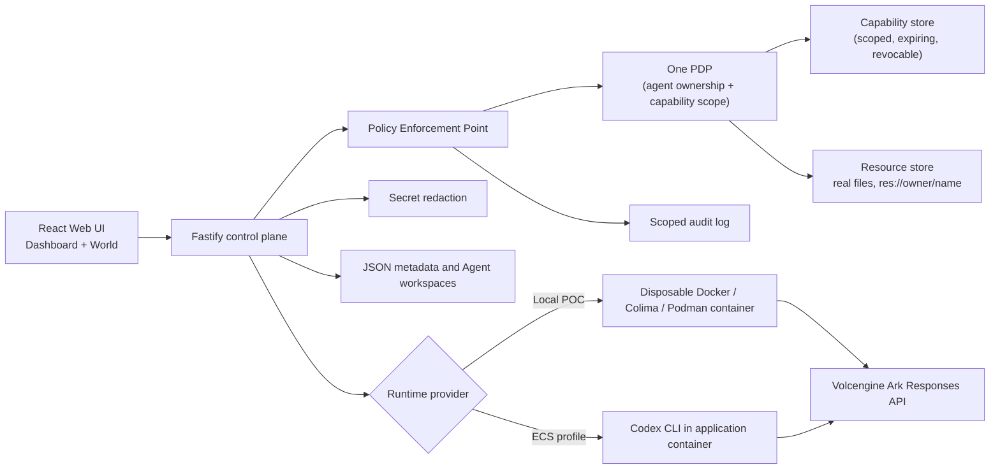

# Volc Agent Launchpad — Agent Pixel World

A middleware-free Agent platform starter kit, extended with real identity and
authorization middleware — and a pixel-art office that visualizes it. Every
door, keycard, and access request on screen is a real allow/deny decision
made by the backend; the animation only ever relays what the server already
decided.

> [!WARNING]
> This is a hackathon proof of concept. Capabilities are in-memory (lost on
> restart), there are two hard-coded demo users, and no real Codex run
> happens without your own Ark credentials. Do not use production data. See
> [Limitations](#limitations) below and [SECURITY.md](SECURITY.md).

## Contents

- [The problem this solves](#the-problem-this-solves)
- [Design summary](#design-summary)
- [Setup instructions](#setup-instructions)
- [Automated tests](#automated-tests)
- [Demo steps](#demo-steps)
- [Limitations](#limitations)
- [No secrets](#no-secrets)
- [Documentation](#documentation)

## The problem this solves

The starter kit this is built on (Agent CRUD, a Fastify control plane,
persistent Codex workspaces) intentionally ships with **no middleware at
all**: no user identity, no authorization, no audit trail. Anyone who can
reach the API can read, edit, or run any Agent. That's fine for a single-user
proof of concept; it's the gap this project fills in.

The brief we built against set a small number of hard rules, and the whole
design follows from them:

1. **Don't break the baseline.** Agent CRUD, lifecycle, chat, persistence,
   and model execution keep working exactly as before.
2. **The middleware must really run**, in the backend request path — not a
   static screen or a hard-coded "Success!".
3. **Enforce at the backend, never the UI.** This applies doubly to the
   animated pixel-art office: the cartoon must never be the thing that
   decides `permit`/`deny`. (This was, for a while, violated — see
   [Design summary](#design-summary) below for how that got fixed.)
4. **Show evidence of both the normal case and a denial/revocation case** —
   a demo that only shows the happy path proves nothing.
5. **Automated tests** for the core behavior, especially the negative
   (denial) tests.
6. **No secrets** committed anywhere — source, git history, logs, demo
   output, screenshots.

The chosen direction is **Identity & Authorization**: prove that an Agent
owned by User A cannot read or touch User B's resources, that access can be
granted and later revoked, and that every decision is attributed in an audit
trail — all backed by real server-side enforcement, presented as an
interactive "who can get into which room" visualization so the story is
vivid on stage rather than just a passing test suite.

## Design summary

One request, one decision, one story, told twice — once as an office, once
as an API:

- **One PDP** (`apps/server/src/policy/pdp.ts`) — the single decision-maker
  for the whole platform, `decide({ principal, action, resource }) →
  { permit | deny, reason }`. It dispatches by resource family: an `Agent`
  (`agent:<ownerId>:<agentId>`) is checked by ownership plus a live keycard
  bound to that owner; a data resource (`res://<ownerId>/<name>`) is checked
  by capability scope.
- **PEP** (`apps/server/src/policy/pep.ts`) — enforces that decision on every
  protected route, so nothing downstream of it can be reached without a
  decision first.
- **Capabilities** (`apps/server/src/capability/`) — the keycards: scoped
  (`<actions>:res://<ownerId>/<glob>`, e.g.
  `read:res://user-a/billing*`), expiring, and revocable. Revocation is a
  **standing decision** — a shredded keycard denies the next access attempt;
  it does not kill a run already in flight (see [Limitations](#limitations)).
- **Resources** (`apps/server/src/resources/`) — each demo user owns a real
  directory of files under `${APP_DATA_DIR}/resources/<ownerId>/`. A
  permitted read genuinely reads a file; a denied read genuinely does not.
- **Secret redaction** (`apps/server/src/secrets/redact.ts`) — strips
  API-key-shaped strings from run output, assistant messages, and errors
  before they're ever persisted or shown.
- **Audit log** (`apps/server/src/audit/log.ts`) — records every decision,
  attributed to the human it was made for, scoped so each user only ever
  sees their own entries.
- **The World** (`apps/web/src/world/`) — a PixiJS-rendered office. Agents
  from the real roster roam it and walk toward whichever room their current
  task actually names (`roomForTask` in `apps/web/src/world/resources.ts`).
  Entering a gated room calls `decideRoomEntry`
  (`apps/web/src/world/decision.ts`), which sends `POST /api/resources/read`
  and renders back exactly the `PolicyDecision` the backend returns —
  `effect`, `reason`, `requestId`, all of it. Granting a keycard calls
  `POST /api/capabilities`; shredding one calls
  `POST /api/capabilities/:id/revoke`; the held set is refreshed from
  `GET /api/capabilities` rather than trusted locally. If the backend is
  unreachable, the World **fails closed** (denies) instead of deciding for
  itself.

**This wasn't always true.** For a stretch of this project, `decision.ts`
decided permit/deny against an in-memory `Map` in the browser while a
complete PDP, capability store, and audit log sat behind endpoints nothing
ever called — a direct violation of rule 3 above. That gap has since been
closed (`apps/web/src/world/decision.ts` now does nothing but ask the
backend and relay the answer), and it's exactly what
`apps/web/src/world/demonstration.test.ts` and the `demo-test-cases/`
scripts exist to keep proven.



See [docs/PERSON3_CONTRACT.md](docs/PERSON3_CONTRACT.md) for the full
capability/resource wire contract, and the design docs under
[docs/design/specs/](docs/design/specs/) for how the World's behavior and
room/capability data model were designed.

## Setup instructions

### Requirements

- Node.js 22+, npm 10+
- Docker, Colima, or Podman
- A Volcengine Ark API key/endpoint — **only needed to let an Agent actually
  run a task.** Every authorization decision below runs and is fully
  testable without one.

### Local development

```bash
npm install
cp .env.example .env
npm install --global @openai/codex@0.111.0
npm run dev
```

- Web UI: <http://localhost:5173>
- API: <http://localhost:3000>

Use local paths in `.env` when running outside Docker:

```dotenv
APP_DATA_DIR=.data
AGENT_WORKSPACE_ROOT=workspaces
CODEX_HOME=codex-home
```

Two demo users are seeded: `user-a`/`demo-a` and `user-b`/`demo-b`. Log in as
either at <http://localhost:5173>.

### One-command local POC (Docker/Colima/Podman)

```bash
ARK_API_KEY=your-ark-api-key \
ARK_MODEL=ep-your-endpoint-id \
npm run poc
```

Installs dependencies, builds the Runtime image, and opens
<http://localhost:3000>. The script auto-selects Docker, Colima, or Podman;
force one with `CONTAINER_ENGINE=podman` (Colima uses `docker`). Stop with
`Ctrl+C` — Agent workspaces and conversations persist under
`~/.volc-agent-launchpad/` (macOS) or `.local/` (Linux), or
`LOCAL_POC_DATA_ROOT` if set.

### Docker Compose

```bash
./scripts/bootstrap-local.sh    # creates .env — fill in ARK_API_KEY, ARK_MODEL, APP_AUTH_TOKEN
docker compose up --build
```

Open <http://localhost:3000>. `docker compose down` stops it without
deleting Agent data.

### Deployment

- [Existing Linux ECS with Docker](docs/DEPLOYMENT.md#existing-linux-ecs)
- [Complete Volcengine environment with Terraform](docs/DEPLOYMENT.md#terraform-deployment)
- [Local Docker, Colima, and Podman details](docs/LOCAL_POC.md)

### Configuration reference

| Variable | Default | Purpose |
| --- | --- | --- |
| `ARK_API_KEY` | Required for real runs | Ark model API key. |
| `ARK_MODEL` | Required for real runs | Responses-capable endpoint or model ID. |
| `ARK_BASE_URL` | Beijing v3 endpoint | Ark OpenAI-compatible API URL. |
| `APP_AUTH_TOKEN` | Empty on loopback | Shared demo token; use 24+ random characters remotely. |
| `RUNTIME_PROVIDER` | `local-process` | `container` for disposable local Runtime containers. |
| `CODEX_SANDBOX_MODE` | `workspace-write` | Codex inner sandbox mode. |
| `CODEX_TIMEOUT_MS` | `600000` | Maximum duration of one turn. |
| `LOCAL_POC_DATA_ROOT` | Platform-specific | Local metadata, workspace, and session directory. |

See [.env.example](.env.example) for all options.

## Automated tests

```bash
npm run check
```

Runs `typecheck`, then `test` (Vitest for both workspaces), then `build`.
Currently **190 server tests + 80 web tests, all passing**, spanning both
positive and negative paths — path traversal attempts, expired/revoked
capabilities, cross-owner access, malformed input, and default-deny on an
internal PDP error, not just the happy path.

Two suites are written specifically to be read as evidence, one claim per
test name:

- **`apps/server/src/demonstration.test.ts`** — the backend half. Claims on
  trial: the decision is made against real files in the real data path; a
  human revoking access changes the very next attempt's outcome; every
  decision is recorded, attributed, and isolated per human.
- **`apps/web/src/world/demonstration.test.ts`** — the frontend half. Claims
  on trial: the World never decides — every permit/deny it shows came from a
  real backend call, which the test asserts by mocking `fetch` and checking
  what was actually asked; and the rooms on screen are configuration, not
  hardcoded — changing which file a room guards changes what the guard is
  asked about.

Run one workspace at a time with `npm run test -w @launchpad/server` or
`npm run test -w @launchpad/web`.

## Demo steps

Two ways to see it work, from least to most setup:

### 1. Scripted evidence (no browser, no Ark key)

```bash
npm run dev                    # in one terminal
./demo-test-cases/run-all.sh   # in another (bash demo-test-cases/run-all.sh on strict shells)
```

Drives the **real, running backend** over HTTP — 41 cases across two files,
nothing stubbed:

- `demo-test-cases/01-what-works.sh` (13 cases) — sign-in, ownership stamped
  server-side, a scoped keycard issued, an Agent actually reading its
  owner's file (contents included, proving it touched disk), both users'
  namespaces listed, a permit recorded and attributed in the audit trail.
- `demo-test-cases/02-what-does-not-work.sh` (28 cases) — the one that
  matters more. No session → `401`. **A's Agent reaching for B's file →
  `403 out-of-scope`, B's secret absent from the response** (the headline
  proof). No keycard, a keycard minted for someone else's namespace, a path
  traversal attempt, an expired keycard, a keycard revoked mid-story with
  the identical request then refused, six different verbs against another
  user's Agent, cross-user audit-log isolation, malformed input.

Exits non-zero on any mismatch and writes `demo-test-cases/transcript.txt`.
Point it elsewhere with `BASE=http://localhost:3000 ./demo-test-cases/run-all.sh`.
`docs/demo/run-evidence.sh` is an earlier, backend-only version of the same
proof (33 assertions across `person3-evidence.sh` and
`agent-isolation-evidence.sh`) — still valid, kept for reference.

### 2. The browser, live

1. Open <http://localhost:5173>, log in as `user-a` / `demo-a`.
2. On the **Dashboard**, create an Agent and give it a task that names one
   of your rooms, e.g. `Update the billing invoice template and add a test.`
3. Switch to the **World** view. Watch the Agent walk toward `Billing`. If
   it doesn't hold a keycard yet, a request appears in your queue — grant
   it, and the Agent walks in; the security log shows the real decision.
4. Open a second session as `user-b` / `demo-b` and try to act on User A's
   Agent, or give an Agent a task naming one of User A's rooms — watch it
   get refused.
5. From the detail panel's keycard wall, shred a granted keycard and repeat
   the same task — the next entry is denied for real, not just visually.

## Limitations

Stated plainly, because a judge (or teammate) will find these anyway:

1. **Capabilities are in-memory.** They do not survive a server restart.
2. **Capabilities are opaque ids, not signed tokens.** Holding the id is
   holding the keycard — fine within one trusted control plane, not a
   pattern for a real deployment.
3. **Revocation takes effect at the next access, not mid-run.** A run
   already in flight is not killed; tearing it down mid-write risks a
   corrupted workspace. Every access is a decision point, so the *next* one
   is genuinely denied.
4. **Two hard-coded users**, no registration, no password hashing.
5. **`POST /api/capabilities` is a demo/testing convenience.** Normally the
   PEP issues a capability at run start; this route exists so the World and
   the evidence scripts have something to hold before that path is
   exercised. It's safe — the owner always comes from the session, never
   the request body — but it's a convenience, not part of the core design.
6. **No Agent actually runs without Ark credentials.** With `ARK_API_KEY`/
   `ARK_MODEL` unset, asking an Agent to do real work returns
   `503 Ark is not configured`. Authorization is fully provable without
   this — the guard runs before the model is ever reached — but Codex
   execution itself is a separate demo that needs real credentials.
7. **Codex's own workspace file access isn't policed by the PDP.** Once an
   Agent is running, its reads/writes inside its workspace go through the
   OS under `CODEX_SANDBOX_MODE`; the real containment there is the
   container's bind mounts, not this middleware.
8. **Resource filenames follow a strict grammar**
   (`[A-Za-z0-9][A-Za-z0-9._-]*`). A file outside that (spaces, a leading
   dot) is reported in a listing's `skipped` array rather than silently
   dropped, but it can't become an addressable resource.
9. **Two deny-reason vocabularies coexist**, one for Agent-ownership denials
   (`not-owner`, `missing-capability`, ...) and one for resource-capability
   denials (`out-of-scope`, `capability-unknown`, ...). They overlap where
   it matters (`capability-revoked`, `capability-expired` are identical in
   both) but diverge elsewhere. Nothing is broken by this — the UI renders
   `decision.reason` verbatim either way — it's just two words for one idea.

## No secrets

Per the brief's hard rule: **nothing real is committed here, ever** — not in
source, git history, logs, demo transcripts, or screenshots.

- The two "secrets" the demo resources contain
  (`res://user-a/secret-recipe.txt`, `res://user-b/tax-return.txt`) are
  fake and labeled as such in the file content itself
  (`SECRET-RECIPE-42 (fake demo data)`) — safe to appear in run output, this
  README's screenshots, or a recorded demo.
- Real credentials (`ARK_API_KEY`, `APP_AUTH_TOKEN`) belong only in your own
  untracked `.env`, never in a commit. `.env.example` documents the shape
  with no real values; copy it, don't edit it in place.
- Outbound secret redaction (`apps/server/src/secrets/redact.ts`) strips
  API-key-shaped strings from Agent run output, assistant messages, and
  errors before they're persisted or shown, so a model that ignores its
  instructions and prints its environment can't leak a key into the stored
  conversation or the browser.
- If you ever suspect a real secret has landed in this repo, see
  [SECURITY.md](SECURITY.md) rather than just deleting the file — git
  history keeps it otherwise.

## Documentation

- [Architecture](docs/ARCHITECTURE.md)
- [Capability/resource contract](docs/PERSON3_CONTRACT.md)
- [API contract (base agent/auth routes; "Other routes" section predates the PDP work and is stale)](docs/API_CONTRACT.md)
- [Local POC](docs/LOCAL_POC.md)
- [Deployment](docs/DEPLOYMENT.md)
- [Hackathon extension guide](docs/HACKATHON_EXTENSION_GUIDE.md)
- [Security policy](SECURITY.md)
- [Contributing](CONTRIBUTING.md)

## License

[MIT](LICENSE)
